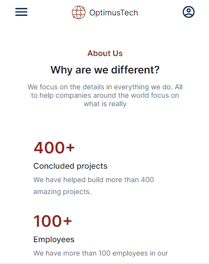
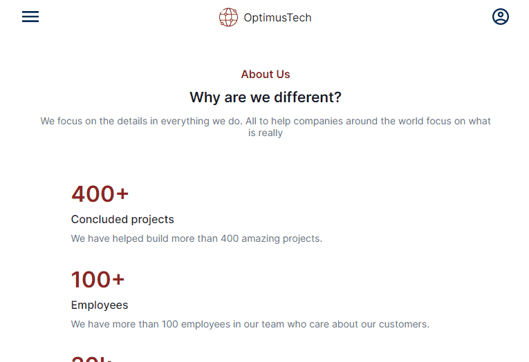
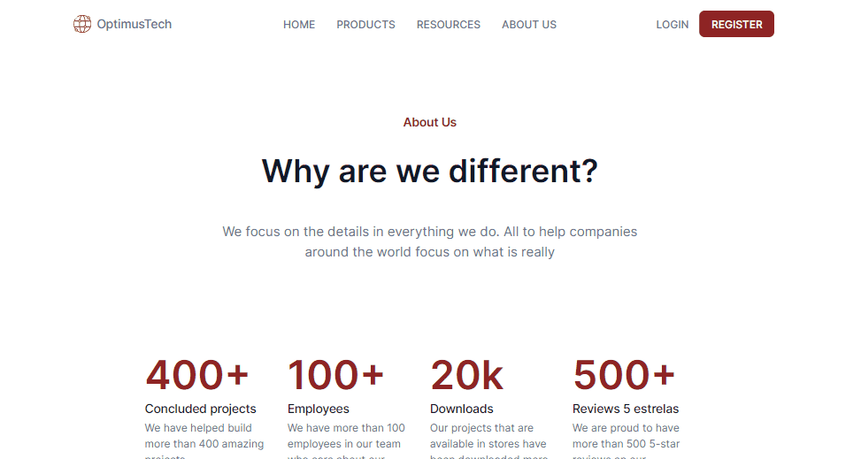

<h1 align='center'> Projects with HTML & CSS only </h1>

   
	
	

_Para a versão em Português, clique [aqui](#portuguese)._

 

### Topics

- [Repository description](#repository-description)

- [Technologies used](#technologies-used)

- [What I learned](#what-I-learned)

- [Project view](#project-view)

 

## Repository description

This repository has some projects developed for HTML and CSS practice. Layouts presented during classes at [Alura](https://www.alura.com.br) technology school.

 

## Technologies used

  
  
  
  
  

 

## What I learned

### Project 'mobile-first-responsive-project': Simulates a virtual bookstore specialized in programming.
- How to make your page dynamic using only HTML and CSS;
- Develop the project considering 'mobile first.

### Project 'sass-petshop-project': Simulates a pet shop blog.
- Use the CSS preprocessor, Sass;
- Implement functions and logic in application stylization;
- Make the application responsive in a simple and reusable way.

### Project '7 days of code': Simulates the website of an online tech recruiting company.
This project is part of the 7-day coding challenge of Alura's Frontend School. In it was passed only the link of the project in figma and 
the code is developed by the dev. My personal challenge was to create the mobile version, which was not passed in the figma. At first I made 
the project desktop only (according to the given layout) but then I decided to refactor the project starting with mobile and then responsive for 
larger screens. I also decided to use the Sass preprocessor. 
- I implemented the CSS architecture technique by arranging the properties in alphabetical order;
- I challenged myself by making two menu versions, the mobile and the larger screen versions;
- First time refactoring an entire project;
- I used mixins and functions to improve the usability of the code.

 

## Project view

### Project 'mobile-first-responsive-project': 

Mobile

Desktop 

Larger Screens 

 

 

 

### Project 'sass-petshop-project':

Mobile

Desktop 

Larger Screens 

 

 

### Project '7 days of code': 

[The figma design](https://www.figma.com/file/mm3MLozvUDGhDRTxSLlGL5/7daysOfCode-HTML-CSS?node-id=0%3A9878&t=09Y2y3RFbmvgWlPC-0)

Mobile

Tablet 

Larger Screens 

 

 

<h1 align='center'> Projetos apenas com HTML e CSS </h1>

   
	
	

 

### Tópicos 

- [Descrição do repositório](#descrição-do-repositório)

- [Tecnologias utilizadas](#tecnologias-utilizadas)

- [O que aprendi](#o-que-aprendi)

- [Visão dos projetos](#visão-dos-projetos)

 

## Descrição do repositório 

Esse repositório contém projetos desenvolvidos para treinar HTML e CSS. Os layouts foram apresentados durante aulas da escola de tecnologia [Alura](https://www.alura.com.br).

 

## Tecnologias utilizadas

  
  
  
  
  

 

## O que aprendi
	
### Projeto 'mobile-first-responsive-project': Simula uma livraria virtual especializada em programação.
- Como deixar a página dinâmica usando apenas HTML e CSS;
- Desenvolver o projeto considerando 'mobile first'.

### Projeto 'sass-petshop-project': Simula o blog de um petshop.
- Usar o pré-processador de CSS, Sass;
- Implementar funções e lógica na estilização da aplicação;
- Tornar a aplicação responsiva de maneira simples e reutilizável.

### Projeto '7 days of code': Simula a página de uma empresa de recrutamento tech online.
Esse projeto faz parte do desafio de 7 dias codando da escola de Frontend da Alura. Nele foi passado apenas o link do projeto 
no figma e o código é desenvolvido por conta do dev. Meu desafio pessoal foi criar a versão mobile, que não foi passada no figma. 
A princípio fiz o projeto apenas desktop (conforme layout dado) mas depois resolvi refatorar o projeto começando pelo mobile e depois o 
responsivo para telas maiores. Decidi também utilizar o pré-processador Sass. 
- Implementei a técnica de arquitetura CSS organizando os as propriedades por ordem alfabética;
- Me desafiei fazendo duas versões de menu, o mobile e o de telas maiores;
- Primeira vez que refatoro um projeto inteiro;
- Utilizei mixins e funções para melhorar a usabilidade do código.

 

## Visão dos projetos

### Projeto 'mobile-first-responsive-project': 

Mobile

Desktop 

Larger Screens 

 
 

### Projeto 'sass-petshop-project':

Mobile

Desktop 

Larger Screens 

 

 
	
### Projeto '7 days of code':
	
[The figma design](https://www.figma.com/file/mm3MLozvUDGhDRTxSLlGL5/7daysOfCode-HTML-CSS?node-id=0%3A9878&t=09Y2y3RFbmvgWlPC-0)

Mobile

Tablet 

Larger Screens 

 

 

Developed with 🧡 by [me](https://www.linkedin.com/in/carolinebarbosavilar/)!
