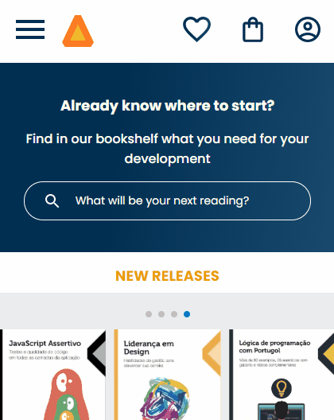
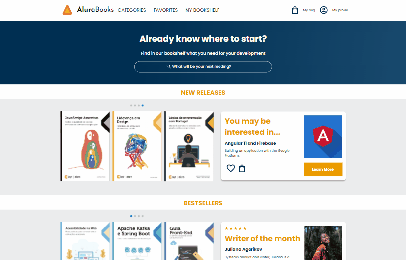

<h1 align='center'> Projects with HTML & CSS only </h1>

   
	
	

_Para a versão em Português, clique [aqui](#portuguese)._

 

### Topics

- [Repository description](#repository-description)

- [Technologies used](#technologies-used)

- [What I learned](#what-I-learned)

- [Project view](#project-view)

 

## Repository description

This repository has some projects developed for HTML and CSS practice. Layouts presented during classes at [Alura](https://www.alura.com.br) technology school.

 

## Technologies used

  
  
  
  
  

 

## What I learned

### Project 'mobile-first-responsive-project': Simulates a virtual bookstore specialized in programming.
- How to make your page dynamic using only HTML and CSS;
- Develop the project considering 'mobile first.

 

## Project view

Project 'mobile-first-responsive-project': 

Mobile

Desktop 

Larger Screens 

 

 

<h1 align='center'> Projetos apenas com HTML e CSS </h1>

   
	
	

 

### Tópicos 

- [Descrição do repositório](#descrição-do-repositório)

- [Tecnologias utilizadas](#tecnologias-utilizadas)

- [O que aprendi](#o-que-aprendi)

- [Visão dos projetos](#visão-dos-projetos)

 

## Descrição do repositório 

Esse repositório contém projetos desenvolvidos para treinar HTML e CSS. Os layouts foram apresentados durante aulas da escola de tecnologia [Alura](https://www.alura.com.br).

 

## Tecnologias utilizadas

  
  
  
  
  

 

## O que aprendi

- Como deixar a página dinâmica usando apenas HTML e CSS;
- Desenvolver o projeto considerando 'mobile first'.

 

## Visão dos projetos

Project 'mobile-first-responsive-project': 

Mobile

Desktop 

Larger Screens 

 
 

Developed with 🧡 by [me](https://www.linkedin.com/in/carolinebarbosavilar/)!
